# Тестування працездатності системи

## Запуск сервера
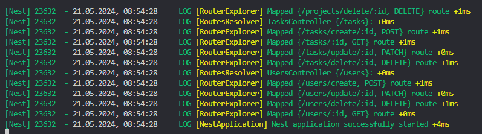

## Створення користувача (POST /users/create)
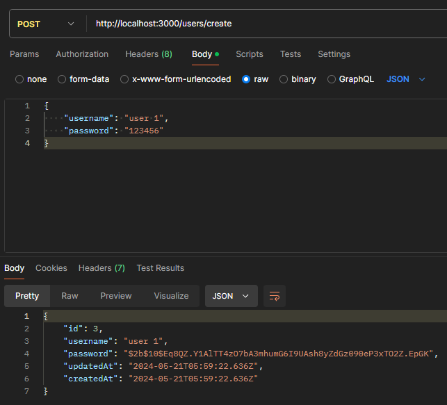

## Створення користувача (POST /users/create | Bad Request)
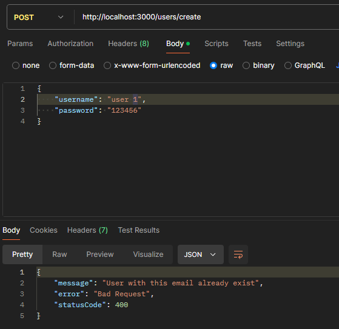

## Отримання даних користувача (GET /users/:id)
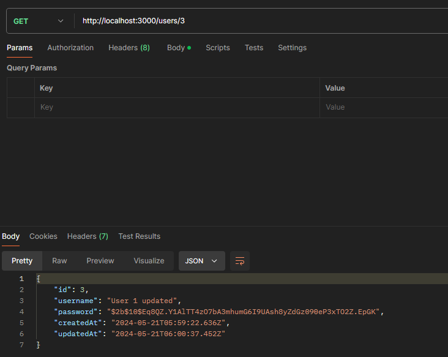

## Отримання даних користувача (GET /users/:id | Not Found)
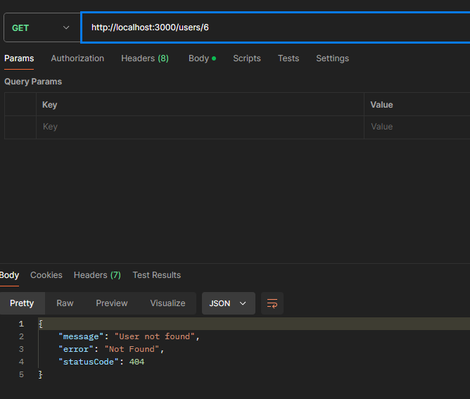

## Оновлення даних користувача (PUTCH /users/update/:id | Без зміни пароля)
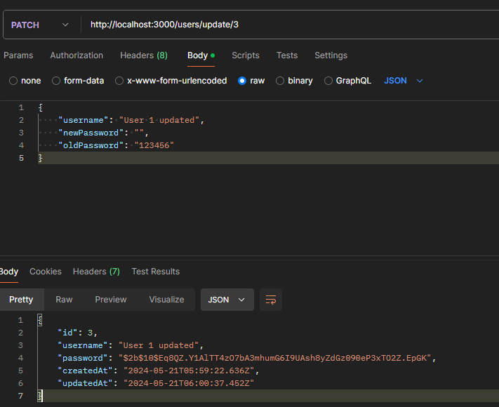

## Оновлення даних користувача (PUTCH /users/update/:id | Зі зміною пароля)
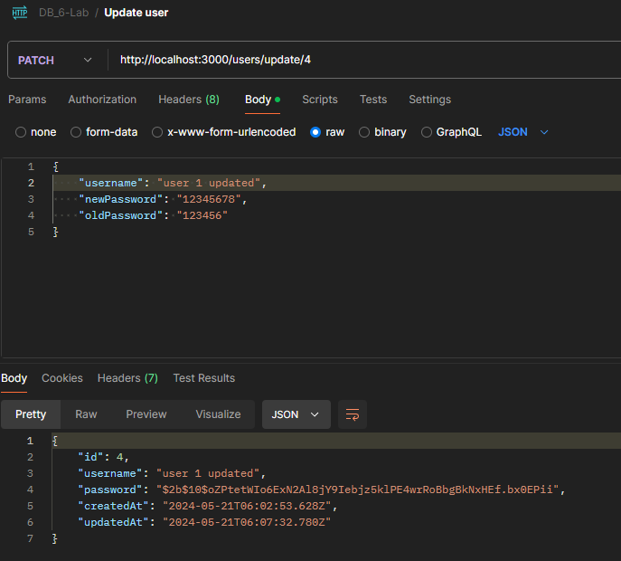

## Оновлення даних користувача (PUTCH /users/update/:id | Not Found)
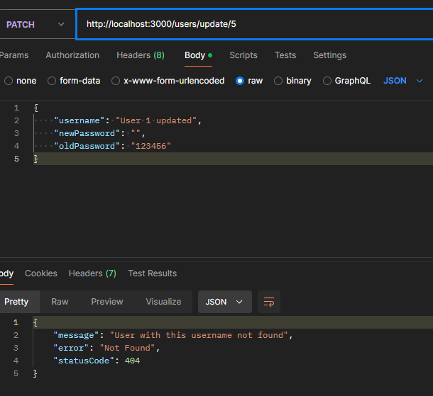

## Оновлення даних користувача на існуючий username(PUTCH /users/update/:id | Bad Request)
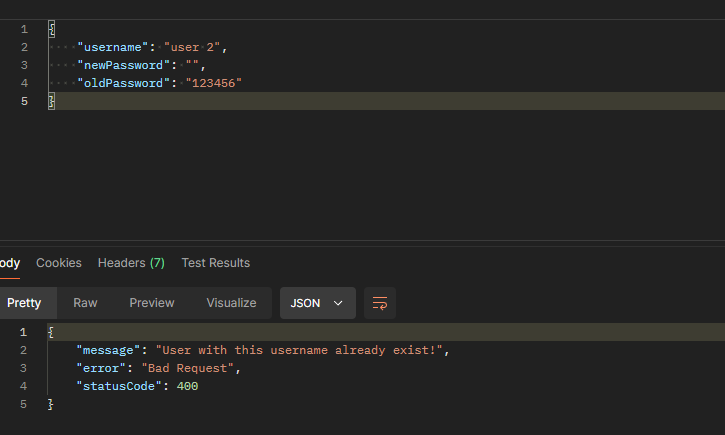

## Оновлення даних користувача з не підтвердженим паролем(PUTCH /users/update/:id | Bad Request)
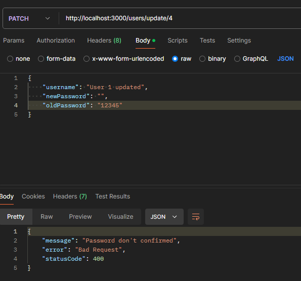

## Видалення користувача(DELETE /users/delete/:id)
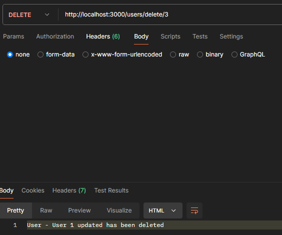

## Видалення користувача(DELETE /users/delete/:id | Not Found)
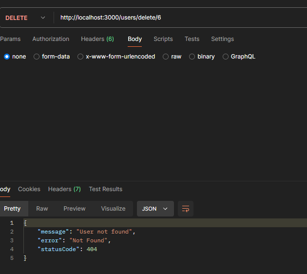

## Створення проєкта (POST /projects/create/:userID)
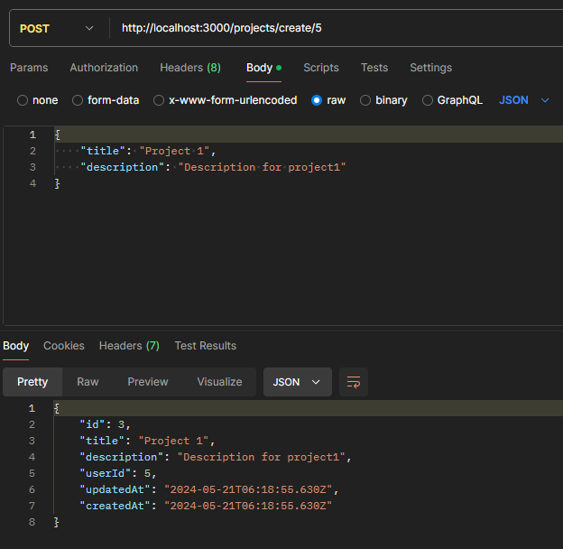

## Отримання інформації про проєкт (GET /projects/:projectID)
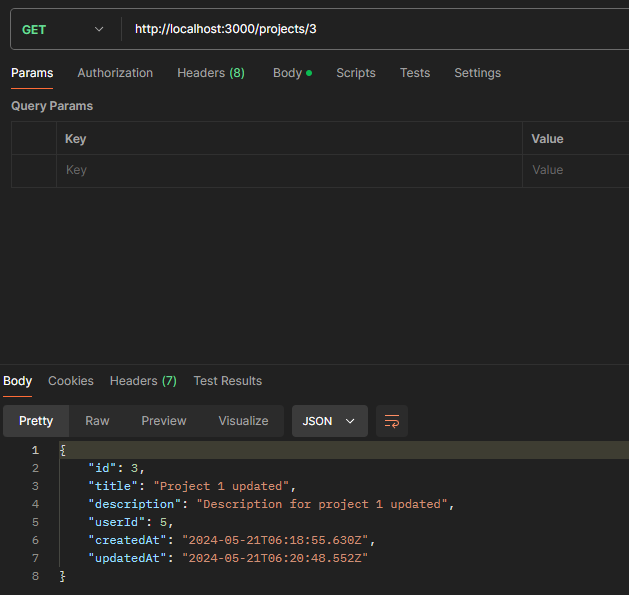

## Отримання інформації про проєкт (GET /projects/:projectID | Not Found)
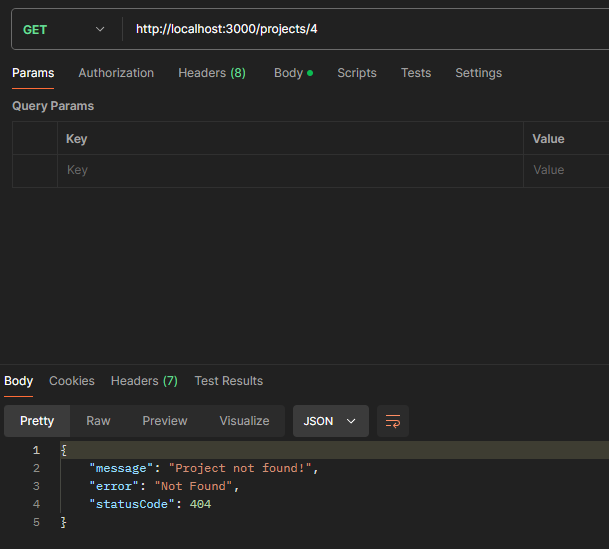

## Оновлення інформації про проєкт (PUTCH /projects/update/:projectID)
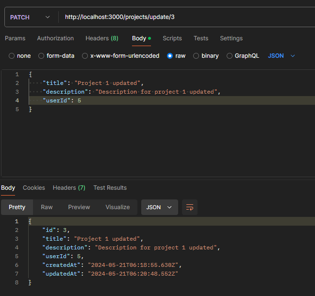

## Оновлення інформації про проєкт (PUTCH /projects/update/:projectID | Not Found)
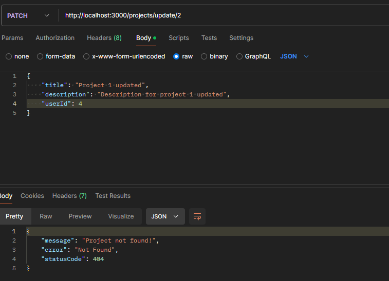

## Видалення проєкту (DELETE /projects/delete/:projectID)
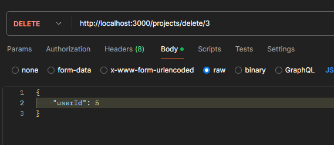

## Видалення проєкту (DELETE /projects/delete/:projectID | Not Found)
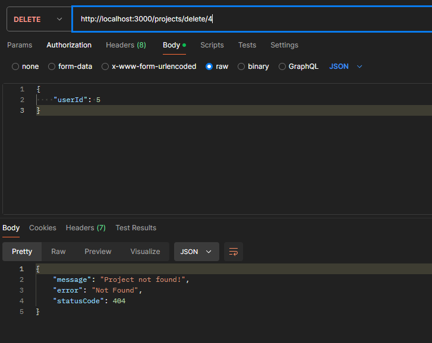

## Створення завдання (POST /tasks/create/:projectID)
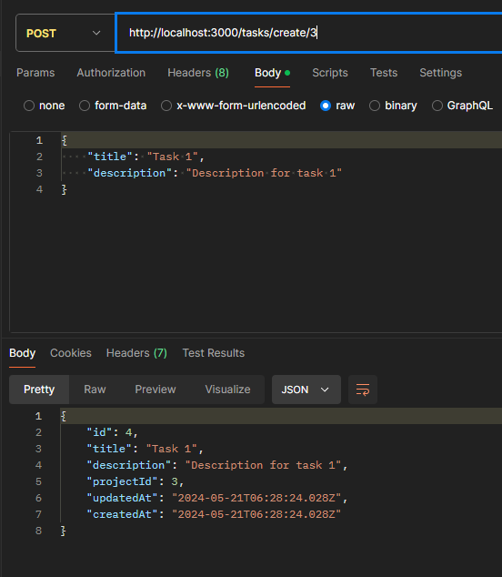

## Отримання інфоромації про завдання (GET /tasks/:taskID)
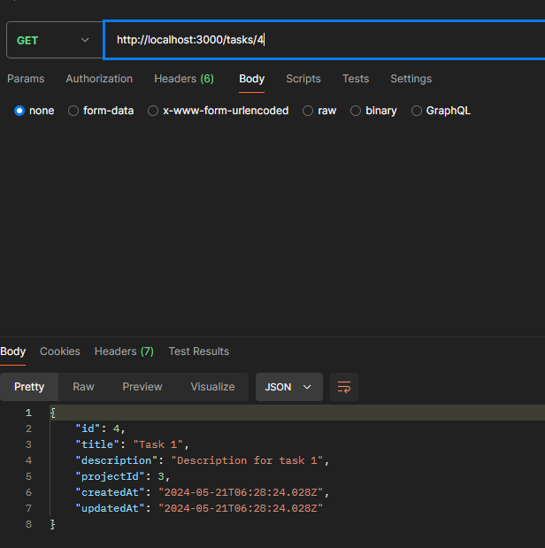

## Отримання інфоромації про завдання (GET /tasks/:taskID | Not Found)
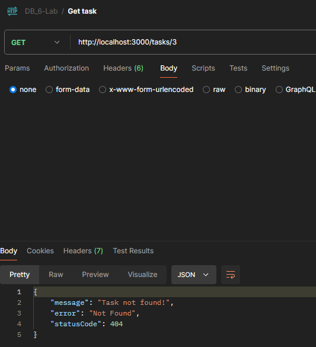

## Оновлення інфоромації про завдання (PUTCH /tasks/update/:taskID)
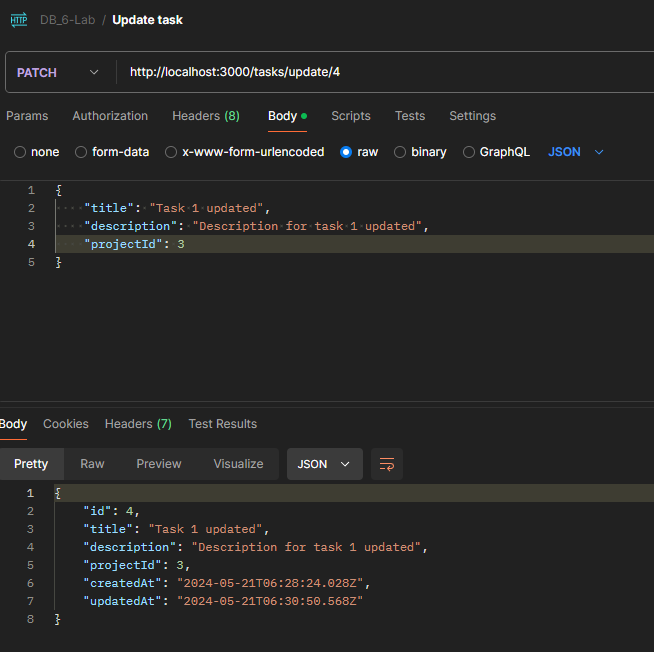

## Оновлення інфоромації про завдання (PUTCH /tasks/update/:taskID | Not Found)
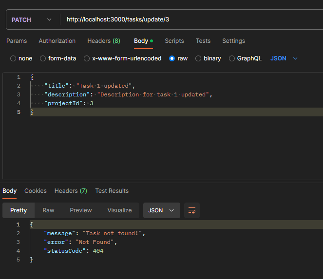

## Видалення завдання (DELETE /tasks/delete/:taskID)
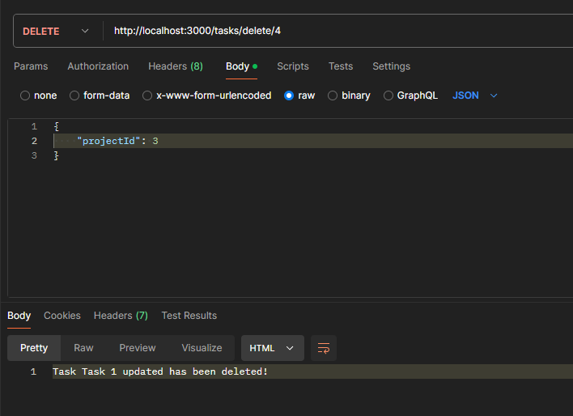

## Видалення завдання (DELETE /tasks/delete/:taskID | Not Found)
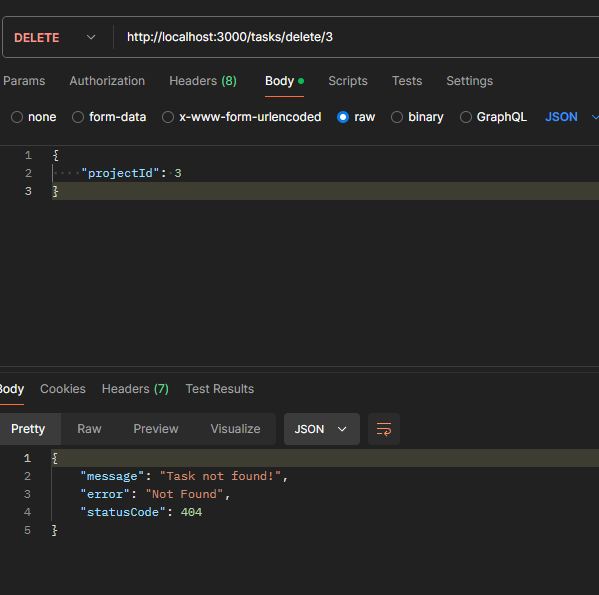